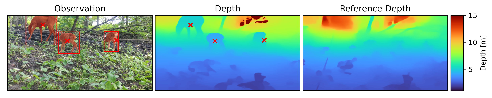

# Distance Estimation for Assessing Animal Abundance



This is an implementation of the methodology proposed in "Overcoming the distance estimation bottleneck in estimating animal abundance with camera traps" [[`Ecological Informatics`](https://doi.org/10.1016/j.ecoinf.2021.101536)] [[`arXiv`](https://arxiv.org/abs/2105.04244)] using the since released [MegaDetector 5.0](https://github.com/microsoft/CameraTraps/releases/tag/v5.0). Both graphical and command-line interfaces are provided for Windows, macOS and Linux.

## Usage

Download the appropriate executable for your platform under [releases](https://github.com/timmh/distance-estimation/releases). Under Windows and Linux, you can directly run the downloaded file. Under macOS, you first need to install the application as usual by copying it into the `Applications` directory (you need to run macOS 11 Big Sur or newer and follow [additional steps](https://support.apple.com/guide/mac-help/open-a-mac-app-from-an-unidentified-developer-mh40616/mac) to open the app). Once running, you may select your input data and configuration. Please refer to the [Data Structure](#data-structure) section for details about the data directory.

## Command Line Usage

The binaries provided under [releases](https://github.com/timmh/distance-estimation/releases) also support operation via the command line instead of a graphical interface. Pass the `--cli --help` flags to get detailed usage instructions.

## Data Structure

During configuration, you must choose the directory which contains your input data and which will also contain the results. You can find an exemplary directory [here](assets/demodata.zip). The data directory must adhere to the following structure:

```bash
DistanceEstimationData
├── results
└── transects
    ├── transect_001
    │   ├── calibration_frames
    │   │   ├── 01.png
    │   │   ├── ...
    │   │   ├── 10.png
    │   │   ├── ...
    │   ├── calibration_frames_masks
    │   │   ├── 01.png
    │   │   ├── ...
    │   │   ├── 10.png
    │   │   ├── ...
    │   └── detection_frames
    │       ├── detection_000001.png
    │       └── ...
    └── ...
```
The root data directory may be named arbitrarily and must contain two subdirectories: `results` (which will contain distance estimations, visualizations, etc.) and `transects`, which should contain an arbitrary number of subdirectories, each representing a single transect or location. Inside each of these directories, there are three more directories. `calibration_frames` should contain photos of reference objects, each named after the distance in meters the respective reference object represents. `calibration_frames_masks` should contain one equally named binary mask image for each of the photos in the `calibration_frames`, where the reference object is marked in white and everything else in black color. To see how the masks are created please take a look at [this demonstration](assets/mask_howto.mp4). The `detection_frames` finally contain arbitrarily named photos of the animals you want to estimate the distance of. Both `.jp(e)g` and `.png` files are supported.

# Acknowledgements
Thanks to [Phil Garthen](https://github.com/pgarthen), [Hari Surya Charan Mudragada](https://github.com/ayrus144), [Stefanie Schwarz](https://github.com/StefanieSwz), [Sebastian Speth](https://github.com/speths), [Hendrik Edelhoff](https://github.com/hendrik-edelhoff) and [Ludwig Bothmann](https://github.com/ludwigbothmann) for pointing out an implementation issue with the computation of world coordinates.

## Citation

If this is useful please consider citing:
```
@article{haucke2022overcoming,
title = {Overcoming the distance estimation bottleneck in estimating animal abundance with camera traps},
author = {Timm Haucke and Hjalmar S. Kühl and Jacqueline Hoyer and Volker Steinhage},
doi = {https://doi.org/10.1016/j.ecoinf.2021.101536},
journal = {Ecological Informatics},
volume = {68},
pages = {101536},
year = {2022},
issn = {1574-9541},
url = {https://www.sciencedirect.com/science/article/pii/S1574954121003277}
}
```
Furthermore, as parts of this software are based on [MegaDetector 5.0](https://github.com/microsoft/CameraTraps/releases/tag/v5.0), [Dense Prediction Transformers](https://github.com/isl-org/DPT), [Segment Anything](https://github.com/facebookresearch/segment-anything), and [Depth Anything](https://github.com/LiheYoung/Depth-Anything) please consider also citing:
```
@article{megadetector,
  title={Efficient pipeline for camera trap image review},
  author={Beery, Sara and Morris, Dan and Yang, Siyu},
  journal={arXiv preprint arXiv:1907.06772},
  year={2019}
}
@inproceedings{dpt,
  title={Vision transformers for dense prediction},
  author={Ranftl, Ren{\'e} and Bochkovskiy, Alexey and Koltun, Vladlen},
  booktitle={Proceedings of the IEEE/CVF International Conference on Computer Vision},
  pages={12179--12188},
  year={2021}
}
@article{segment_anything,
  title={Segment Anything},
  author={Kirillov, Alexander and Mintun, Eric and Ravi, Nikhila and Mao, Hanzi and Rolland, Chloe and Gustafson, Laura and Xiao, Tete and Whitehead, Spencer and Berg, Alexander C. and Lo, Wan-Yen and Doll{\'a}r, Piotr and Girshick, Ross},
  journal={arXiv:2304.02643},
  year={2023}
}
@inproceedings{depthanything,
  title={Depth Anything: Unleashing the Power of Large-Scale Unlabeled Data}, 
  author={Yang, Lihe and Kang, Bingyi and Huang, Zilong and Xu, Xiaogang and Feng, Jiashi and Zhao, Hengshuang},
  booktitle={CVPR},
  year={2024}
}
```
